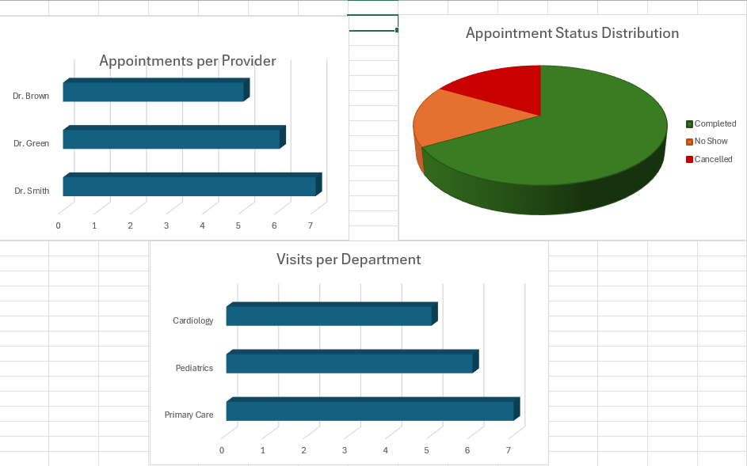

# EHR Data Migration & Workflow Optimization (NextGen)  
*(Healthcare Systems & Data Analysis Project)*

> Simulation of a healthcare practice transitioning from paper-based records to a structured Electronic Health Record (EHR) system

---

## 📌 Project Overview

This project simulates a real-world healthcare data migration process where a practice transitions from paper-based patient records and appointment tracking to a digital EHR system.

The goal is to design a structured data system, analyze workflows, and demonstrate how digital transformation improves efficiency, accuracy, and reporting capabilities.

The project demonstrates core **Data Analyst and Systems skills**, including:
- Data modeling  
- SQL querying and analysis  
- Workflow optimization  
- System design  
- Data migration concepts  
- Technical documentation  

---

## 🎯 Project Objectives

- Simulate migration from paper-based records to digital systems  
- Design a relational database for healthcare data  
- Analyze patient visits, provider workload, and appointment trends  
- Identify inefficiencies in manual workflows  
- Demonstrate how EHR systems improve operational visibility  

---

## 🧩 Problem Statement

Healthcare practices transitioning from paper-based systems often face:

- Manual data entry and duplication  
- Inconsistent record-keeping  
- Limited reporting capabilities  
- Inefficient scheduling workflows  
- Increased risk of errors  

A centralized EHR system is required to improve data accuracy, workflow efficiency, and decision-making.

---

## 🛠 Tools & Technologies

- SQL (data analysis and querying)  
- CSV datasets (data modeling)  
- Excel (dashboard visualization)  
- GitHub (version control and documentation)  

---

## 📂 Project Deliverables

- Patient and appointment datasets  
- SQL schema and queries  
- Workflow analysis  
- Dashboard visualization  
- System design documentation  

---

## 🔄 Workflow Overview

### As-Is Process (Paper-Based)
- Manual patient intake  
- Paper appointment tracking  
- Limited centralized reporting  
- High risk of inconsistency  

### To-Be Process (EHR System)
- Digital patient records  
- Structured appointment tracking  
- Centralized database system  
- Real-time reporting and analytics  

---

## 📊 Key Analysis Areas

- Provider workload distribution  
- Appointment status trends  
- Visit frequency  
- Workflow efficiency improvements  

---

## 📋 System Features

### Functional Features
- Patient record storage  
- Appointment tracking  
- Provider assignment  
- Status tracking (completed, cancelled, no show)  
- Reporting and analytics  

### Non-Functional Features
- Data consistency  
- Scalable design  
- Efficient query performance  

---

## 📊 Key Metrics

- Total appointments  
- Completion rate  
- Cancellation and no-show rates  
- Appointments per provider  

---

## 🧠 Skills Demonstrated

- SQL and data analysis  
- Data modeling and relational design  
- Workflow optimization  
- Healthcare systems understanding  
- Analytical thinking  

---

## 💻 Technical & Engineering Perspective

This project demonstrates how healthcare workflows can be translated into a structured software system.

The system can be extended into a full-stack application with:

- Backend services for data processing (Node.js / Python)  
- Relational database for structured data (SQL)  
- Frontend dashboard for reporting (React)  
- API-driven architecture for scalability  

---

## 🏗️ System Architecture

**Data Source**
- CSV datasets  

**Processing Layer**
- SQL queries for analysis  

**Visualization Layer**
- Excel dashboard  

**Output**
- Insights and reports  

---

## 🔧 API Design

### Example Endpoints

**Create Patient**  
`POST /api/patients`

**Get Patient Record**  
`GET /api/patients/{id}`

**Create Appointment**  
`POST /api/appointments`

**Get Appointment Data**  
`GET /api/appointments`

**Update Appointment Status**  
`PUT /api/appointments/{id}/status`

**Get Reports**  
`GET /api/reports`

This API structure demonstrates how the project could be extended into a scalable healthcare workflow system.

---

## 🗄️ Database Schema

### Tables

**Patients**
- patient_id (Primary Key)  
- first_name  
- last_name  
- date_of_birth  
- gender  
- diagnosis  

**Providers**
- provider_id (Primary Key)  
- provider_name  
- specialty  

**Appointments**
- appointment_id (Primary Key)  
- patient_id (Foreign Key)  
- provider_id (Foreign Key)  
- appointment_date  
- status  

This schema supports structured storage, reporting, and relationship mapping across healthcare records.

---

## 📊 Dashboard
The dashboard below highlights key operational insights, including provider workload and appointment status trends.

This visualization demonstrates how healthcare data can be used to improve workflow efficiency and support decision-making.


### Key Insights

- Dr. Smith handled the highest number of appointments
- Completed visits made up the majority of appointment outcomes
- Primary Care had the highest visit volume across departments

---

## 🚀 Future Improvements

- Integrate with live database (PostgreSQL/MySQL)
- Build interactive dashboard (Power BI / Tableau)
- Add real-time analytics
- Expand dataset for deeper insights

---

## Example SQL Queries
```sql
-- Count total appointments
SELECT COUNT(*) FROM appointments;

-- Appointments per provider
SELECT provider, COUNT(*) 
FROM appointments
GROUP BY provider
ORDER BY COUNT(*) DESC;

-- Status distribution
SELECT status, COUNT(*) 
FROM appointments
GROUP BY status;

-- Trends over time
SELECT appointment_date, COUNT(*) 
FROM appointments
GROUP BY appointment_date

---

## 📁 Project Structure
ehr-data-migration-project/
├── data/
│   └── ehr-appointments.csv
├── sql/
│   └── ehr-queries.sql
├── visuals/
│   └── ehr-dashboard.png
├── README.md

---
